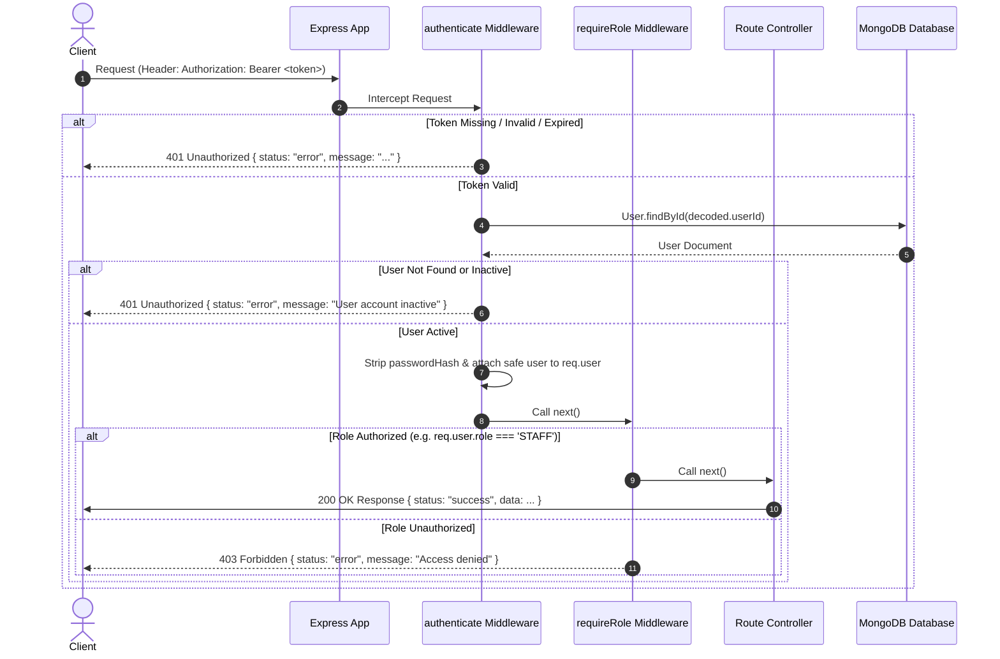

# System Architecture Documentation

This document describes the technical architecture, request lifecycles, and security model for the **Class Booking** application.

---

## 1. Overview & Monorepo Structure

```
class-booking/
├── client/           # React + Vite Frontend
├── server/           # Node.js + Express Backend API
│   ├── src/
│   │   ├── config/      # DB connection config
│   │   ├── controllers/ # HTTP request handlers
│   │   ├── middleware/  # Auth, role authorization, error handling
│   │   ├── models/      # Mongoose MongoDB schemas
│   │   ├── routes/      # API endpoints definitions
│   │   ├── services/    # Core business logic
│   │   ├── utils/       # Helper functions
│   │   ├── app.js       # Express app setup & route mounting
│   │   └── server.js    # HTTP listener entry point
└── docs/             # Technical architecture & schema docs
```

---

## 2. Authentication & Authorization Architecture

### 2.1 Password Security & Explicit Selection
- Passwords are hashed using `bcryptjs` before storage in MongoDB.
- In the `User` Mongoose schema, `passwordHash` is defined with `select: false` to ensure password hashes are never returned by default in queries or API responses.
- During authentication (`POST /api/auth/login`), `authService` explicitly includes the field using `User.findOne({ email }).select('+passwordHash')` to perform bcrypt hash verification.

### 2.2 JWT Token Architecture
- Upon successful password verification, `authService` signs a JsonWebToken (JWT) containing a minimal payload:
  ```json
  {
    "userId": "66d5b0a1c2e4f3a8b9d7e1c2",
    "role": "STAFF",
    "iat": 1725270000,
    "exp": 1725356400
  }
  ```
- Secrets (`JWT_SECRET`) and expiration durations (`JWT_EXPIRES_IN`) are configured dynamically via environment variables.

---

## 3. Request Authentication Lifecycle



---

## 4. Implemented API Endpoint Authorization Matrix

### 4.1 Authentication Routes (`/api/auth`)
- `POST /api/auth/login` — Public
- `GET /api/auth/me` — Protected (`authenticate`)

### 4.2 User Lookup Routes (`/api/users`)

- `GET /api/users?role=INSTRUCTOR` — Protected endpoint used by staff session and recurring-session forms to retrieve active instructors. Returns only `_id`, `name`, `email`, and `role`. Password hashes and other sensitive fields are never returned.

### 4.3 Class Management Routes (`/api/classes`)
- `GET /api/classes` — Protected (`requireRole('STAFF', 'INSTRUCTOR')`). Returns active classes. `includeArchived=true` parameter is strictly restricted to `STAFF` users (returns `403 Forbidden` if requested by `INSTRUCTOR`).
- `GET /api/classes/:id` — Protected (`requireRole('STAFF', 'INSTRUCTOR')`).
- `POST /api/classes` — Protected (`requireRole('STAFF')`). Validates `defaultDuration >= 1` and `defaultCapacity >= 1`.
- `PATCH /api/classes/:id` — Protected (`requireRole('STAFF')`).
- `PATCH /api/classes/:id/archive` — Protected (`requireRole('STAFF')`). Soft-archives class without deleting existing sessions or bookings.
- `PATCH /api/classes/:id/restore` — Protected (`requireRole('STAFF')`). Reactivates an archived class.

### 4.4 Member Management Routes (`/api/members`)
- `GET /api/members` — Protected (`requireRole('STAFF')`). Access denied for `INSTRUCTOR` (`403 Forbidden`).
- `GET /api/members/:id` — Protected (`requireRole('STAFF')`). Access denied for `INSTRUCTOR` (`403 Forbidden`).
- `POST /api/members` — Protected (`requireRole('STAFF')`). Trims/lowercases email, enforces email uniqueness, validates `membershipExpiry`.
- `PATCH /api/members/:id` — Protected (`requireRole('STAFF')`). Allows updating member details and renewing/updating `membershipExpiry` dates.

### 4.5 Room Management Routes (`/api/rooms`)
- `GET /api/rooms` — Protected (`requireRole('STAFF', 'INSTRUCTOR')`). Excludes archived rooms by default. `includeArchived=true` restricted to `STAFF`.
- `GET /api/rooms/:id` — Protected (`requireRole('STAFF', 'INSTRUCTOR')`).
- `POST /api/rooms` — Protected (`requireRole('STAFF')`). Enforces unique room name and `capacity >= 1`.
- `PATCH /api/rooms/:id` — Protected (`requireRole('STAFF')`).
- `PATCH /api/rooms/:id/archive` — Protected (`requireRole('STAFF')`). Soft-archives room.
- `PATCH /api/rooms/:id/restore` — Protected (`requireRole('STAFF')`). Reactivates room.

### 4.6 Session Scheduling Routes (`/api/sessions`)
- `GET /api/sessions` — Protected (`requireRole('STAFF', 'INSTRUCTOR')`). Server-side role filtering: `INSTRUCTOR` users only receive sessions where they are assigned as primary or co-instructor.
- `GET /api/sessions/:id` — Protected (`requireRole('STAFF', 'INSTRUCTOR')`). Server-side authorization check ensures instructors can only view assigned sessions.
- `POST /api/sessions` — Protected (`requireRole('STAFF')`). Validates class, room, active `INSTRUCTOR` roles, computes `startDateTime`/`endDateTime`, and enforces room/instructor overlap prevention.
- `PATCH /api/sessions/:id` — Protected (`requireRole('STAFF')`). Updates session schedule with overlap verification excluding current session ID.
- `DELETE /api/sessions/:id` / `PATCH /api/sessions/:id/cancel` — Protected (`requireRole('STAFF')`). Sets status to `CANCELLED`, freeing up room and instructor time slots.

### 4.7 Booking Management Routes (`/api/bookings`)
- `POST /api/bookings` — Protected (`requireRole('STAFF')`). Creates booking. Validates non-expired membership (`membershipExpiry >= currentDate`), enforces duplicate check, assigns `BOOKED` or `WAITLISTED` based on session capacity, logs `BookingHistory`.
- `GET /api/bookings` — Protected (`requireRole('STAFF', 'INSTRUCTOR')`). Retrieves bookings with filtering and pagination.
- `GET /api/bookings/:id` — Protected (`requireRole('STAFF', 'INSTRUCTOR')`). Retrieves single booking details.
- `GET /api/bookings/:id/history` — Protected (`requireRole('STAFF', 'INSTRUCTOR')`). Retrieves chronological immutable audit log history.
- `PATCH /api/bookings/:id/cancel` — Protected (`requireRole('STAFF')`). Cancels booking (`BOOKED` or `WAITLISTED`). If a `BOOKED` reservation is cancelled, auto-promotes earliest `WAITLISTED` booking to `BOOKED`.
- `PATCH /api/bookings/:id/attendance` — Protected (`requireRole('STAFF')`). Marks `ATTENDED` or `NO_SHOW` after `session.startDateTime`. Rejects early attendance attempts.

### 4.8 Recurring Session Routes (`/api/sessions/recurring`)

- `POST /api/sessions/recurring` — Protected (`requireRole('STAFF')`). Generates sessions across a date range from a weekly pattern. Uses class defaults when duration/capacity are not overridden, checks room and instructor conflicts, skips conflicting occurrences, prevents duplicate generation, and reports created and skipped sessions with reasons.

### 4.9 Dashboard Routes (`/api/dashboard`)

- `GET /api/dashboard` — Protected (`requireRole('STAFF')`). Returns server-side dashboard metrics including today's sessions, today's bookings, weekly no-shows, current waitlisted members, bookings by status/class, and attendance for the last 8 weeks.

### 4.10 Membership Alert Routes (`/api/membership-alerts`)

- `GET /api/membership-alerts` — Protected (`requireRole('STAFF')`). Returns members whose membership has expired or expires within the next 7 days.
- `GET /api/membership-alerts/count` — Protected (`requireRole('STAFF')`). Returns the active alert count used by the navigation badge.
- `PATCH /api/membership-alerts/:memberId/dismiss` — Protected (`requireRole('STAFF')`). Dismisses the alert for the member's current expiry date. If the expiry date is later changed and falls within the alert window, the alert can become active again.

---

## 5. Overlap Prevention Algorithm & Business Rules

1. **Overlap Condition**:
   A collision exists if an existing non-cancelled session satisfies:
   `existing.startDateTime < newEndDateTime AND existing.endDateTime > newStartDateTime`
2. **Room Collision Prevention**:
   No two active (`SCHEDULED`) sessions can share the same `room` during overlapping time slots.
3. **Instructor Collision Prevention**:
   No active `INSTRUCTOR` user can be double-booked during overlapping time slots, whether assigned as `primaryInstructor` or as a `coInstructor`.
4. **Contiguous Sessions**:
   Back-to-back sessions are permitted (where `endDateTime` of session A equals `startDateTime` of session B).
5. **Cancelled Sessions**:
   Sessions marked `CANCELLED` are ignored during overlap checks, allowing the time slot to be reused.
