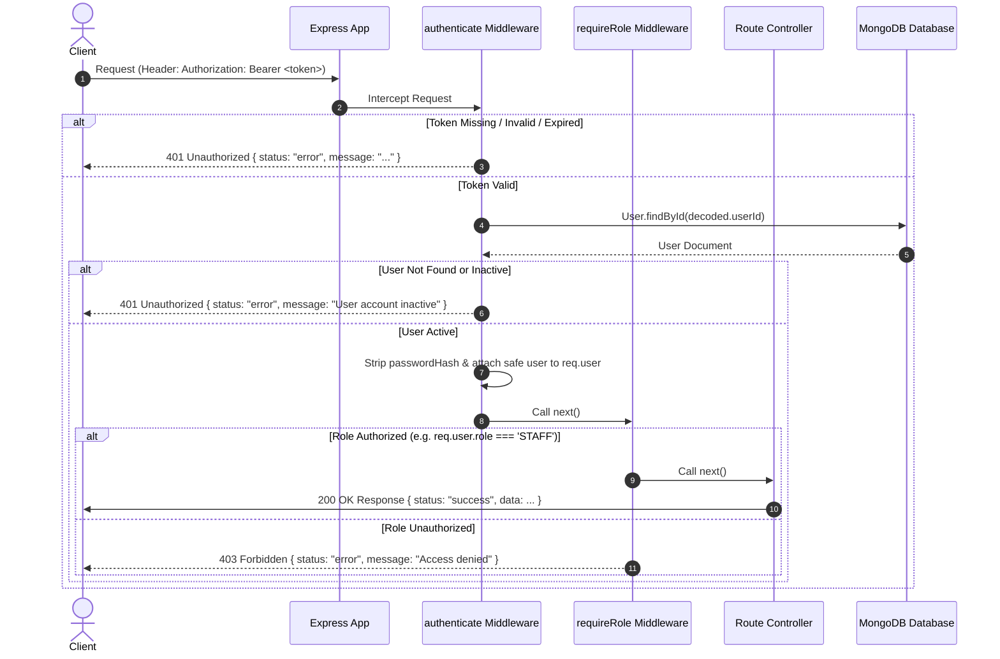

# System Architecture Documentation

This document describes the technical architecture, request lifecycles, and security model for the **Class Booking** application.

---

## 1. Overview & Monorepo Structure

```
class-booking/
├── client/           # React + Vite Frontend
├── server/           # Node.js + Express Backend API
│   ├── src/
│   │   ├── config/      # DB connection config
│   │   ├── controllers/ # HTTP request handlers
│   │   ├── middleware/  # Auth, role authorization, error handling
│   │   ├── models/      # Mongoose MongoDB schemas
│   │   ├── routes/      # API endpoints definitions
│   │   ├── services/    # Core business logic
│   │   ├── utils/       # Helper functions
│   │   ├── app.js       # Express app setup & route mounting
│   │   └── server.js    # HTTP listener entry point
└── docs/             # Technical architecture & schema docs
```

---

## 2. Authentication & Authorization Architecture

### 2.1 Password Security & Explicit Selection
- Passwords are hashed using `bcryptjs` before storage in MongoDB.
- In the `User` Mongoose schema, `passwordHash` is defined with `select: false` to ensure password hashes are never returned by default in queries or API responses.
- During authentication (`POST /api/auth/login`), `authService` explicitly includes the field using `User.findOne({ email }).select('+passwordHash')` to perform bcrypt hash verification.

### 2.2 JWT Token Architecture
- Upon successful password verification, `authService` signs a JsonWebToken (JWT) containing a minimal payload:
  ```json
  {
    "userId": "66d5b0a1c2e4f3a8b9d7e1c2",
    "role": "STAFF",
    "iat": 1725270000,
    "exp": 1725356400
  }
  ```
- Secrets (`JWT_SECRET`) and expiration durations (`JWT_EXPIRES_IN`) are configured dynamically via environment variables.

---

## 3. Request Authentication Lifecycle



---

## 4. Implemented API Endpoint Authorization Matrix

### 4.1 Authentication Routes (`/api/auth`)
- `POST /api/auth/login` — Public
- `GET /api/auth/me` — Protected (`authenticate`)

### 4.2 Class Management Routes (`/api/classes`)
- `GET /api/classes` — Protected (`requireRole('STAFF', 'INSTRUCTOR')`). Returns active classes. `includeArchived=true` parameter is strictly restricted to `STAFF` users (returns `403 Forbidden` if requested by `INSTRUCTOR`).
- `GET /api/classes/:id` — Protected (`requireRole('STAFF', 'INSTRUCTOR')`).
- `POST /api/classes` — Protected (`requireRole('STAFF')`). Validates `defaultDuration >= 1` and `defaultCapacity >= 1`.
- `PATCH /api/classes/:id` — Protected (`requireRole('STAFF')`).
- `PATCH /api/classes/:id/archive` — Protected (`requireRole('STAFF')`). Soft-archives class without deleting existing sessions or bookings.
- `PATCH /api/classes/:id/restore` — Protected (`requireRole('STAFF')`). Reactivates an archived class.

### 4.3 Member Management Routes (`/api/members`)
- `GET /api/members` — Protected (`requireRole('STAFF')`). Access denied for `INSTRUCTOR` (`403 Forbidden`).
- `GET /api/members/:id` — Protected (`requireRole('STAFF')`). Access denied for `INSTRUCTOR` (`403 Forbidden`).
- `POST /api/members` — Protected (`requireRole('STAFF')`). Trims/lowercases email, enforces email uniqueness, validates `membershipExpiry`.
- `PATCH /api/members/:id` — Protected (`requireRole('STAFF')`). Allows updating member details and renewing/updating `membershipExpiry` dates.
